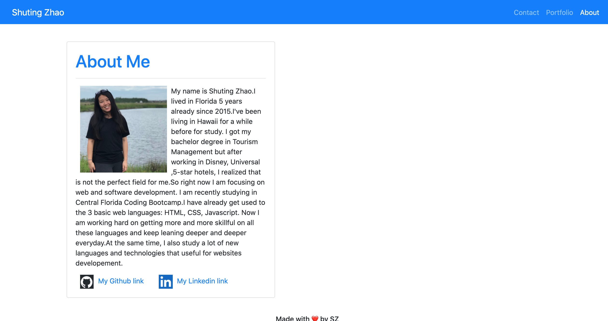
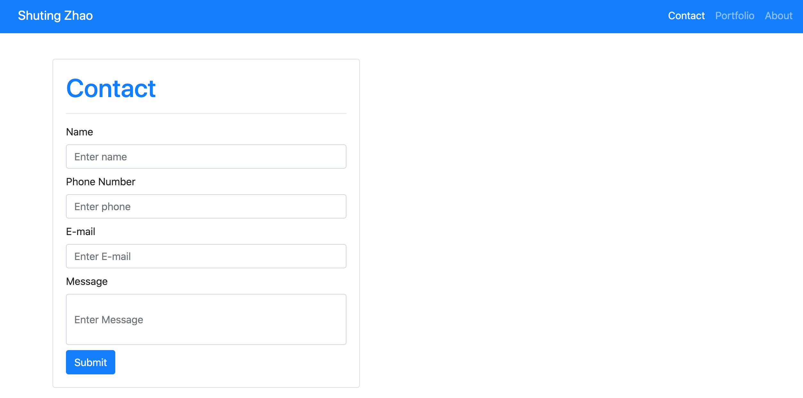
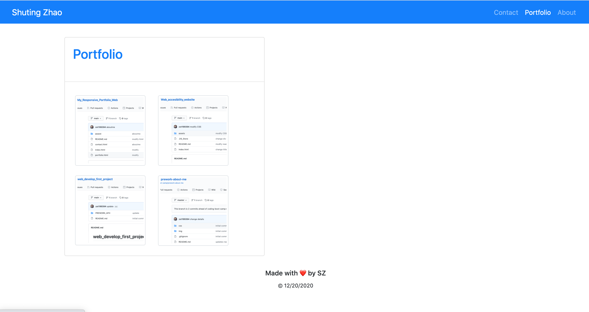

# Project Overview
In this portfillio page https://zst199394.github.io/portfolio_feb2021/, I am using the Bootstrap CSS Framework to create my mobile responsive portfolio.In this portfolio, it will contain the contact, portfolio and also about me,total 3 pages. 

## Languages and Libraries Used
* HTML
* CSS
* Bootstrap
* JavaScript
* jQUERY
* w3school
* Google

## Responsive Portfolio Goal
Responsive design ensures that web applications render well on a variety of devices and window or screen sizes. As a developer, we will likely be asked to create a mobile-first application or add responsive design to an existing application. 
* Functional, deployed application

* GitHub repository with README describing the project

* Navbar must be consistent on each page.

* Navbar on each page must contain links to Home/About, Contact, and Portfolio pages.

* All links must work.

* Use semantic html.

* Each page must have valid and correct HTML. 

* Contain your personalized information. (bio, name, images, links to social media, etc.)

* Able to properly utilize Bootstrap components and grid system.

## Process
Use the Bootstrap CSS Framework to create a mobile responsive portfolio.
* Create the following files files: `index.html`, `portfolio.html` and `contact.html`.
* Using Bootstrap, develop my portfolio site with the following items:
   * A navbar
   * A responsive layout
   * Responsive images
   * Use Bootstrap's grid system (containers, rows, and columns).
   * On an `xs` screen, content should take up the entire screen. On `sm` and larger screens, you should have some margins on the left and right sides of the screen. Check out various sites on your mobile device vs. your computer to see examples of these differences.
   * Use an HTML validation service to ensure that each page has valid HTML.
   * Functional, deployed application

 Modify all the codes to make sure Navbar consistent on each page,and Navbar on each page contains links to About, Contact, and Portfolio pages.Update the webs until all the links work.Use semantic html elements and give each page must have valid and correct HTML. Fill it up with personalized information. (bio, name, images, links to social media, etc.)

 At the end, properly utilize Bootstrap components and grid system to make the page look like what we expext.Then push to the Github.

